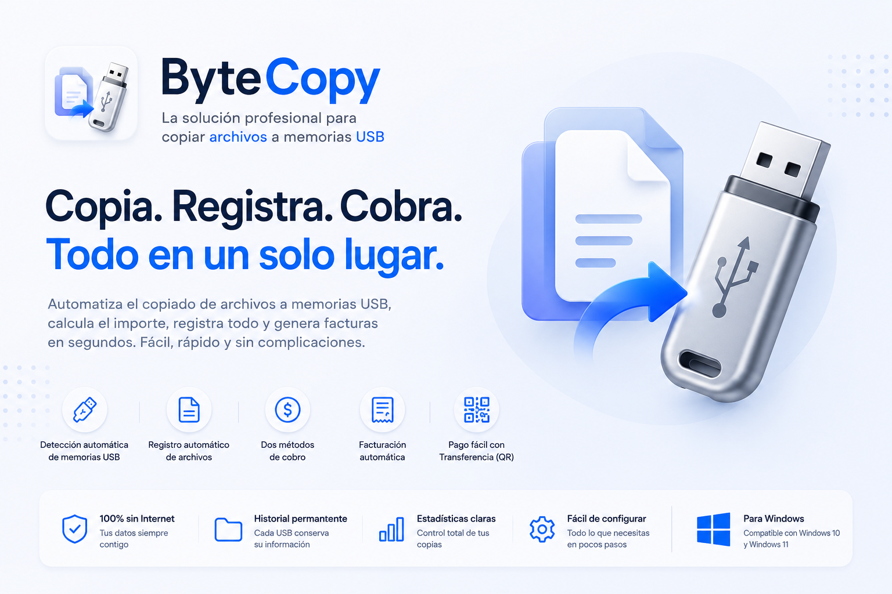
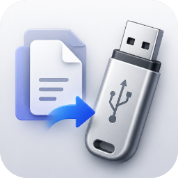

# ByteCopy

  

  

<h3 align="center">
La forma más rápida y profesional de gestionar copias de archivos a memorias USB.
</h3>

Convierte tu negocio de copiado de archivos en un proceso automático, organizado y sin cálculos manuales.

---

## 🚀 ¿Qué es ByteCopy?

**ByteCopy** es una aplicación de escritorio, diseñada especialmente para negocios dedicados al copiado de archivos a memorias USB.

La aplicación detecta automáticamente las memorias conectadas, registra cada archivo copiado, calcula el importe según el método de cobro configurado y genera una factura lista para entregar al cliente.

Todo esto desde una interfaz moderna, rápida y muy fácil de utilizar.

---

# ✨ Características

## 🔌 Detección automática de memorias USB

- Detecta automáticamente memorias USB y discos externos.
- Ignora el disco del sistema para evitar registros innecesarios.
- Monitorea las copias en tiempo real.

---

## 📂 Registro automático de archivos

Cada archivo copiado queda registrado automáticamente con información como:

- Nombre
- Tamaño
- Fecha
- Categoría
- Precio
- Unidad USB donde fue copiado

No es necesario añadir los archivos manualmente.

---

## 💰 Dos formas de cobro

### Por tamaño (GB)

Calcula automáticamente el importe según:

- Precio por GB
- Tamaño total copiado
- Moneda configurada

---

### Por categorías

También puedes cobrar por tipo de contenido.

Por ejemplo:

- 🎬 Películas
- 📺 Series
- 🎮 Juegos
- 📚 Cursos
- 💻 Programas
- 📱 Aplicaciones

O cualquier otra categoría personalizada.

Cada categoría puede tener su propio precio independiente.

---

## 🧠 Detección inteligente de categorías

ByteCopy identifica automáticamente la categoría del contenido copiado.

Puede reconocer archivos cuando:

- La carpeta copiada tiene el nombre de una categoría.
- La carpeta coincide con la carpeta raíz configurada.
- El contenido pertenece a una carpeta existente dentro del directorio configurado.

Esto permite trabajar sin tener que renombrar carpetas especiales para cada cliente.

---

## 📊 Historial de copias

Cada memoria USB conserva su propio historial.

La aplicación identifica cada dispositivo mediante su **Volume ID**, por lo que el historial permanece incluso aunque cambie la letra de la unidad.

---

## 🧾 Facturación automática

Con un solo clic puedes generar una factura que incluye:

- Lista de archivos
- Tamaño
- Precio
- Total
- Nombre del negocio

La factura se guarda automáticamente en la memoria USB del cliente.

---

## 💳 Pago mediante Transferencia

ByteCopy puede generar un código QR listo para escanear con **Transfermóvil**.

Solo debes configurar:

- Número de tarjeta
- Número de confirmación

El cliente podrá realizar el pago directamente desde su teléfono.

---

## ⚙️ Configuración sencilla

Desde el panel de ajustes puedes configurar:

- Nombre del negocio
- Moneda
- Precio por GB
- Método de cobro
- Categorías ilimitadas
- Carpetas de origen
- Precio por categoría
- Datos para pagos por transferencia

---

## 🎨 Interfaz moderna

- Diseño limpio
- Glassmorphism oscuro
- Totalmente responsive
- Animaciones suaves
- Configuración organizada por secciones

---

## 📈 Estadísticas

La pantalla principal muestra:

- Memorias USB conectadas
- Total de archivos copiados
- Historial de facturas
- Información resumida por dispositivo

---

## 🗂 Historial permanente

Toda la información se almacena localmente.

No requiere:

- Bases de datos
- Internet
- Servicios externos

Los datos permanecen disponibles incluso después de reiniciar la aplicación.
---

# 💼 Ideal para

- Negocios de copiado de memorias USB
- Cibercafés
- Centros de impresión
- Tiendas de informática
- Técnicos informáticos
- Distribución de contenido digital

---

# ❤️ ¿Por qué ByteCopy?

✅ Automatiza el registro de archivos

✅ Evita errores al cobrar

✅ Genera facturas en segundos

✅ Organiza el historial de cada memoria USB

✅ Compatible con categorías ilimitadas

✅ Interfaz moderna y fácil de usar

✅ Funciona completamente sin conexión a Internet

---

Desarrollado con ❤️ ByteBloom.

